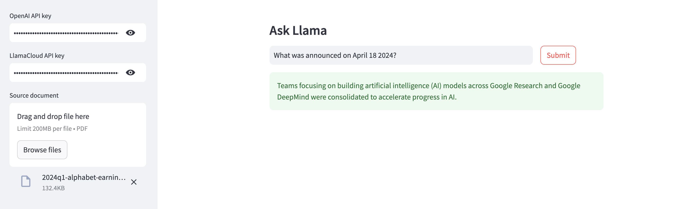

# llama-index
A Streamlit app for chatting with PDFs using [LlamaIndex](https://www.llamaindex.ai/) and [LlamaParse](https://docs.cloud.llamaindex.ai/llamaparse/getting_started). You'll need API keys from [OpenAI](https://platform.openai.com/api-keys) and [LlamaCloud](https://cloud.llamaindex.ai/api-key) for this project.

For a step-by-step guide, see [this](https://alphasec.io/chat-with-pdf-using-llamaindex-and-llamaparse/) post. To deploy on [Railway](https://railway.app/?referralCode=alphasec), click the button below.

