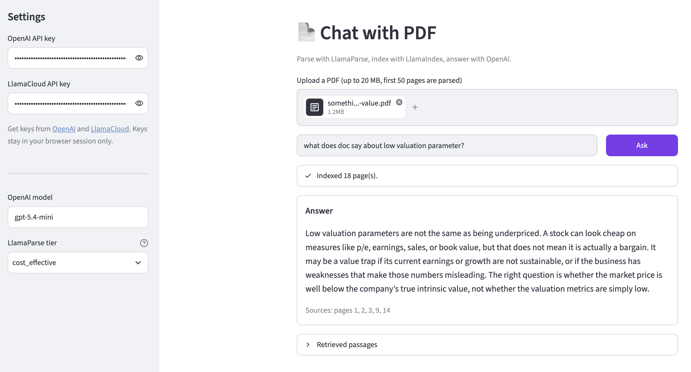

# chat-with-pdf
A Streamlit app for asking questions about a PDF using [LlamaIndex](https://www.llamaindex.ai) and [LlamaParse](https://developers.llamaindex.ai/python/cloud/). You'll need API keys from [OpenAI](https://platform.openai.com/api-keys) and [LlamaCloud](https://cloud.llamaindex.ai) for this project.



## How it works
1. The PDF is parsed into per-page markdown by LlamaParse, via the [`llama-cloud`](https://github.com/run-llama/llama-cloud-py) SDK.
2. The pages are embedded with OpenAI and stored in a LlamaIndex `VectorStoreIndex`.
3. Each question retrieves the most relevant pages and an OpenAI model writes the answer, citing the source pages.

The document is parsed and indexed once per session, so follow-up questions don't use extra LlamaParse credits. You can pick the OpenAI model and LlamaParse tier (`fast`, `cost_effective`, `agentic`, `agentic_plus`) in the sidebar.

## Configuration
All settings are optional environment variables.

| Variable | Default | Description |
|----------|---------|-------------|
| `OPENAI_MODEL` | `gpt-5.4-mini` | Default chat model (editable in the sidebar) |
| `OPENAI_EMBED_MODEL` | `text-embedding-3-small` | Embedding model |
| `LLAMA_PARSE_TIER` | `cost_effective` | Default LlamaParse tier (editable in the sidebar) |
| `MAX_PAGES` | `50` | Maximum pages parsed per PDF |

Uploads are limited to 20 MB.

## Run and deploy
```bash
python -m venv .venv && source .venv/bin/activate
pip install -r requirements.txt
streamlit run streamlit_app.py
```

For a step-by-step guide, see [this](https://alphasec.io/chat-with-pdf-using-llamaindex-and-llamaparse/) post. To deploy on [Railway](https://railway.com?referralCode=alphasec), click the button below.

[](https://railway.com/deploy/GpZ0J4?referralCode=alphasec)
