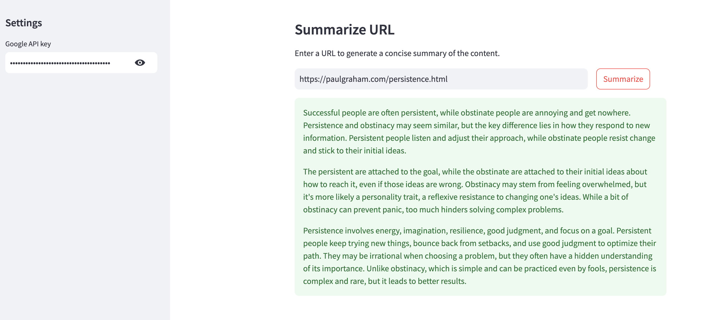

# summarize-url
A sample Streamlit application to summarize URL content using LlamaIndex and OpenAI. You'll need an API key from [OpenAI](https://platform.openai.com/api-keys) for this project.

For a detailed guide, see [this](https://alphasec.io/blinkist-for-urls-with-llama-index-and-openai) post. To deploy on [Railway](https://railway.app/?referralCode=alphasec) using a one-click template, click the button below.

